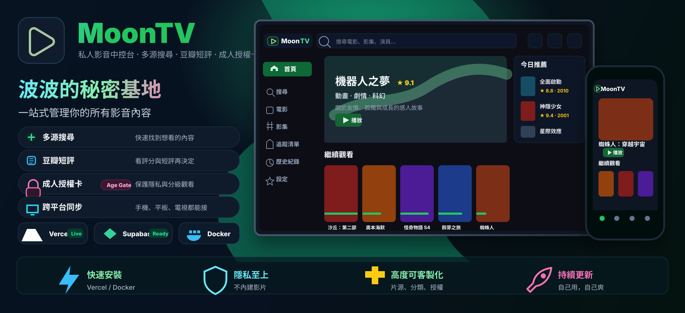

<div align="center">
  

  <br />

  
  
  
  
  
</div>

## Highlights

| 多源搜尋                                          | 豆瓣短評                                           | 成人授權卡                                                        | 外部播放器                                               |
| ------------------------------------------------- | -------------------------------------------------- | ----------------------------------------------------------------- | -------------------------------------------------------- |
| 聚合 Apple CMS V10 來源，後台可排序、停用、分組。 | 播放頁直接看評分與短評，失敗會重試，不假裝零評論。 | 管理員發日、周、月、年、永久卡，未授權者連 API 都拿不到成人推薦。 | PotPlayer、VLC、MPV、MX Player、nPlayer、IINA 一鍵帶走。 |

## Run

```bash
corepack enable
corepack pnpm install
corepack pnpm dev
```

```bash
corepack pnpm test --runInBand
corepack pnpm typecheck
corepack pnpm lint
corepack pnpm build
```

## Deploy

推薦路線：**Vercel + Supabase**。

```env
NEXT_PUBLIC_STORAGE_TYPE=supabase
SUPABASE_URL=https://your-project.supabase.co
SUPABASE_SERVICE_ROLE_KEY=your-service-role-key
USERNAME=admin
PASSWORD=your-admin-password
NEXT_PUBLIC_SITE_NAME=波波的秘密基地
```

Supabase 初始化 SQL：

```sql
create table if not exists public.moontv_kv (
  key text primary key,
  value jsonb not null,
  updated_at timestamptz not null default now()
);

create index if not exists moontv_kv_key_prefix_idx
  on public.moontv_kv (key text_pattern_ops);

alter table public.moontv_kv enable row level security;
```

## Admin

| 後台       | 能做什麼                                            |
| ---------- | --------------------------------------------------- |
| `/admin`   | 站點設定、用戶、分組、片源、分類、TVBox、資料遷移。 |
| 用戶配置   | 新增用戶、封禁、升管理員、分配可用片源。            |
| 成人授權卡 | 生成卡號，普通用戶輸入後才可看成人推薦。            |
| 視頻源配置 | 新增、停用、排序、批量管理 Apple CMS 來源。         |

## Source

```json
{
  "api_site": {
    "example": {
      "api": "https://example.com/api.php/provide/vod",
      "name": "示例資源",
      "detail": "https://example.com"
    }
  }
}
```

## Notes

- 不內建影片。
- 不儲存影片。
- 不提供影片檔。
- 必須設定 `PASSWORD`。
- 公網部署建議關閉註冊：`NEXT_PUBLIC_ENABLE_REGISTER=false`。
- 成人內容用授權卡控管，API 使用 `private, no-store`。

## More

<details>
  <summary>儲存後端</summary>

| 後端            | 狀態           |
| --------------- | -------------- |
| Supabase        | 推薦           |
| Upstash Redis   | 支援           |
| Redis / Kvrocks | 支援           |
| Cloudflare D1   | 支援           |
| localstorage    | 僅適合單機體驗 |

</details>

<details>
  <summary>Upstash 搬到 Supabase</summary>

```bash
node scripts/migrate-upstash-to-supabase.mjs --dry-run
node scripts/migrate-upstash-to-supabase.mjs
```

</details>

<details>
  <summary>TVBox</summary>

後台開啟 TVBox 後使用生成的配置地址：

```text
/api/tvbox/config?un=...
```

</details>

## License

[MIT](LICENSE)
